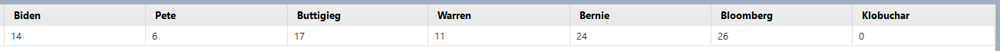
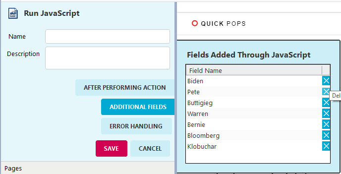

# mo-KeywordCounter
 Counts pre-determined keywords

In Mozenda, you can input this into a "JavaScript Action" and it will automatically create fields with counts for each of those keywords by the title of that keyword. Below, I'll show an example of this from the website "Politico".

### Politico Example

We're going to use the commented out keywords from the mo-Keyword-Counter.js to count how many mentions there are of democratic candidates on politico. Running this javascript in Mozenda on the politico website returns these items as seen below.

To add a search word/name is relatively simple. You just add it to the code. However, in order to drop a column you have to delete it both from the code and an additional spot in Mozenda. For this example, let's get rid of "Pete" since we already have Buttigieg listed. Open the "JavaScript Action" and select "Additional Fields". Here, you should see a list of the fields you are currently capturing. After editing the JavaScript to no longer have "Pete" listed, you will need to delete it from the "Additional Fields" list. This is just by selecting the blue X, pictured below.

